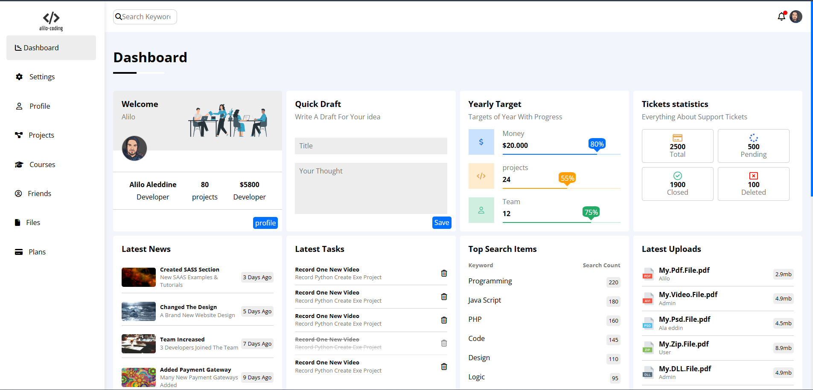
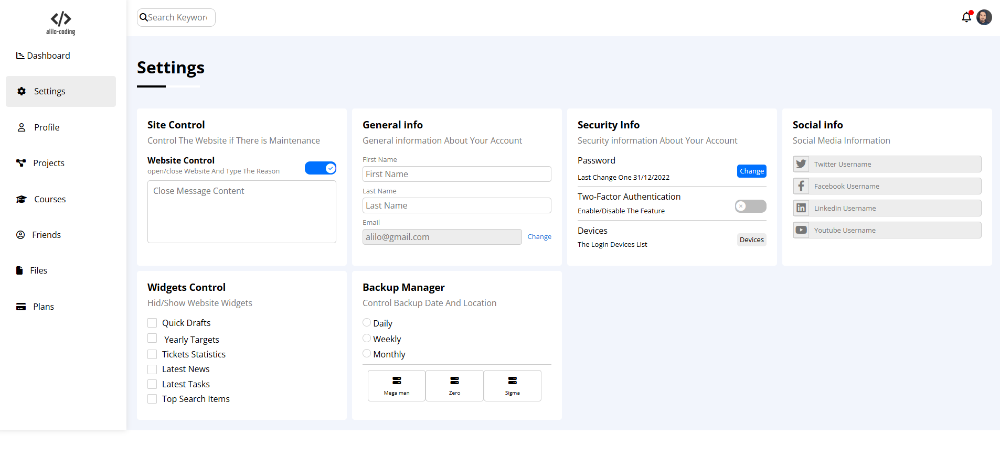
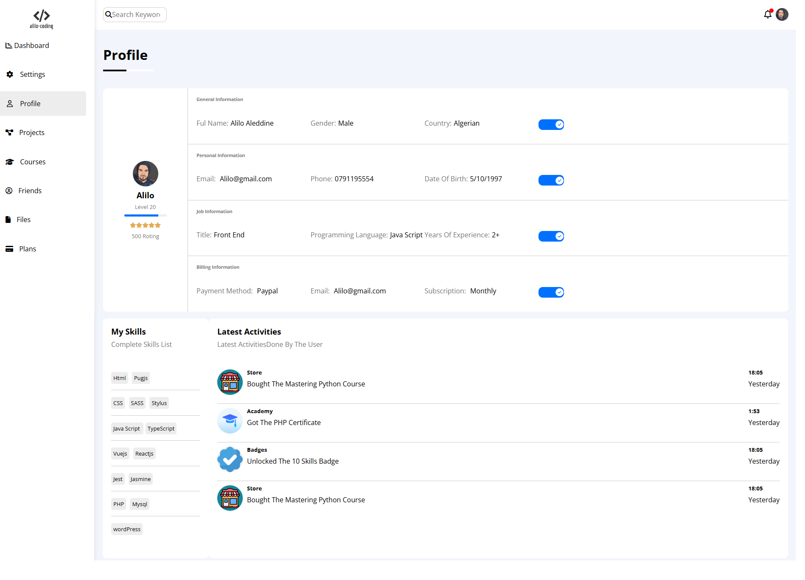
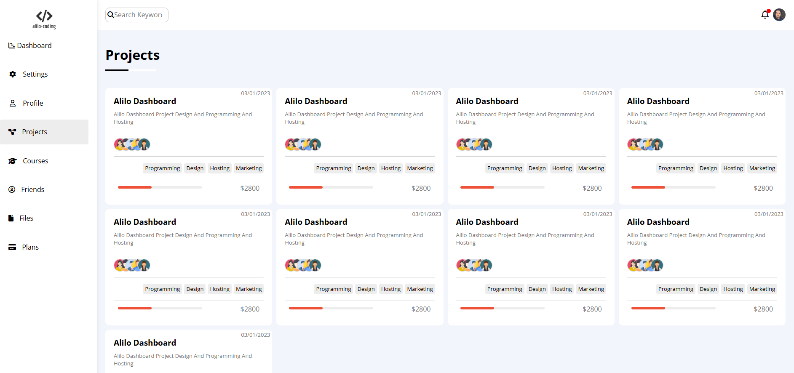
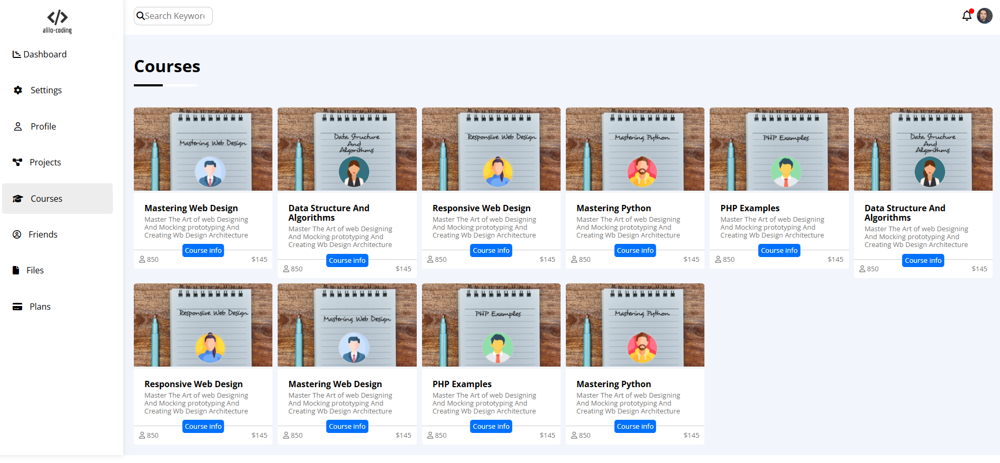
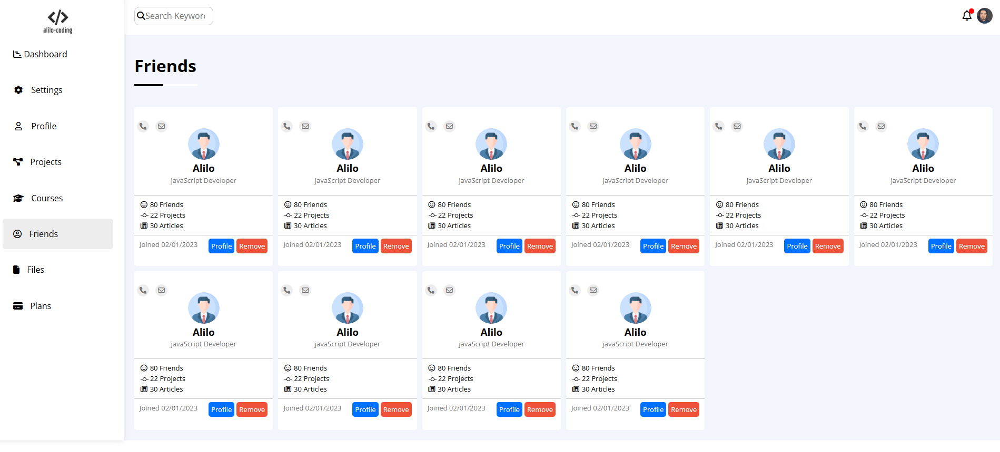
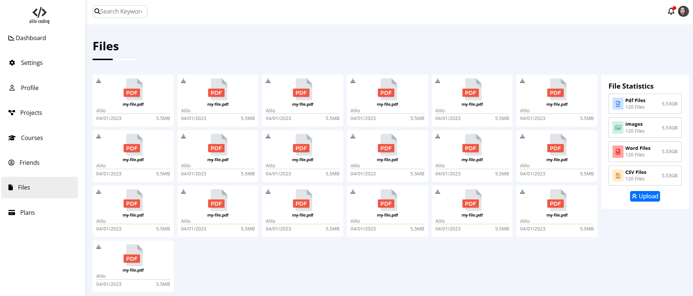
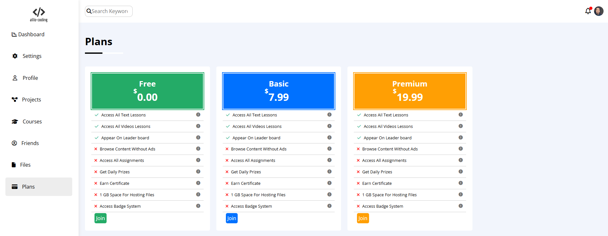

# Alilo Coding — Admin Dashboard Template

> A fully-featured, multi-page **Admin Dashboard** UI template built with pure **HTML5 and CSS3** — no JavaScript, no frameworks. Features a persistent collapsible sidebar, a rich custom CSS utility framework (`fremwork.css`) with 13 Roman-numeral color scales, and 8 fully linked dashboard pages.

---

## 📸 Preview

| | | |
|---|---|---|
|  |  |  |
|  |  |  |
|  |  | |

---

## ✨ Features

- **8 Fully Linked Pages** — all sharing the same persistent sidebar with active-link highlighting
- **Zero JavaScript** — layout, interactions, and custom form controls are pure CSS
- **Custom CSS Utility Framework** (`fremwork.css`, 800+ lines) — class-based utility system inspired by Tailwind CSS
- **13-Scale Color System** — Roman-numeral CSS variables (`--I` through `--XIII`) for monochromatic color management
- **Custom Form Controls** — pure CSS checkboxes, radio buttons, and toggle switches styled from scratch
- **Responsive Sidebar** — collapses from full text labels to icon-only on mobile (`max-width: 768px`)
- **Custom Scrollbar** — styled with `::webkit-scrollbar` (blue thumb, grey track)
- **CSS Progress Bars** — with live percentage labels via `data-percent` + `attr()`
- **Overlapping Team Avatars** — project table rows show stacked circular avatar images with border separation
- **Vertical Timeline** — project progress steps with a connecting CSS vertical line
- **3-Column CSS Grid** — responsive dashboard card grid that stacks on mobile

---

## 🗂️ Project Structure

```
tmplelet4/
│
├── tump4.html          # 📊 Dashboard — main page (12 widgets + projects table)
├── Settings.html       # ⚙️  Settings page
├── profile.html        # 👤 User profile page
├── Projects.html       # 📁 Projects page
├── Courses.html        # 🎓 Courses page
├── Friends.html        # 👥 Friends / social page
├── Files.html          # 📂 Files manager page
├── Plans.html          # 💳 Pricing plans page
│
├── css/
│   ├── fremwork.css    # Custom CSS utility framework (800+ lines, 13 color scales)
│   ├── main.css        # Dashboard component styles (sidebar, header, cards, scrollbar)
│   ├── all.min.css     # Font Awesome 6 (self-hosted)
│   └── normalize.css   # Cross-browser reset
│
├── imag/
│   ├── alio coding.png         # Sidebar logo
│   ├── a.png, alilo.jpg        # User avatars
│   ├── avatar1.png – avatar10.png  # Team member avatars (projects table)
│   ├── team working.png        # Welcome card background image
│   ├── rocket.png              # Project progress card illustration
│   ├── news1.jpg – news4.jpg   # Latest News thumbnails
│   ├── notebook.jpg            # Courses page image
│   ├── pdf.png, avi.png, psd.png,
│   │   zip.png, dll.png, eps.png  # File type icons (Latest Uploads)
│   ├── Design.png – Design5.png    # Design project thumbnails
│   ├── Academy.png, Badges.png,
│   │   Store.png               # Course category icons
│   └── check.png               # Checkmark icon
│
├── webfonts/           # Self-hosted Font Awesome 6 font files
│   ├── fa-solid-900.*
│   ├── fa-brands-400.*
│   ├── fa-regular-400.*
│   └── fa-v4compatibility.*
│
└── imageGithub/        # Preview screenshots for README
    └── 1.png – 8.png
```

---

## 🎨 Color System (`fremwork.css`)

The framework defines **13 monochromatic color scales** using Roman-numeral CSS custom properties:

| Variable | Background | Text/Alt | Role |
|---|---|---|---|
| `--I` | `#ffffff` | `#000000` | Base white / primary text |
| `--II` | `#000000` | `#ffffff` | Dark / inverted |
| `--III` | `#f2f5fc` | — | Page background |
| `--IV` | `#ededed` | `#777777` | Grey surfaces / secondary text |
| `--V` | `#0071ff` | `#1760ec` | Blue primary / buttons |
| `--VI` | `#cbe2ff` | `#2774db` | Blue light (info badges) |
| `--VII` | `#ffebcd` | `#e7a94a` | Orange light (warnings) |
| `--VIII** | `#ff9f04` | — | Orange (progress bars) |
| `--IX` | `#d1efe0` | `#4bc29e` | Green light (success badges) |
| `--X` | `#24ab67` | — | Green (progress fills) |
| `--XI` | `#ed5138` | `red` | Red-orange (delete icons) |
| `--XII` | `#ff0000` | rgba | Red (danger) |
| `--XIII` | `#1396f5` | — | Sky blue (Twitter) |

To theme the entire dashboard, update these root variables in `fremwork.css`.

---

## 🧰 Utility Class System (`fremwork.css`)

The framework ships with a large utility class library. Key categories:

### Flexbox
```css
.d-flex      /* display: flex */
.f-align-s   /* align-items: flex-start */
.a-item      /* align-items: center */
.j-con-sb    /* justify-content: space-between */
.j-con-sa    /* justify-content: space-around */
.j-con-c     /* justify-content: center */
.f-der-c     /* flex-direction: column */
.f-wrap      /* flex-wrap: wrap */
.flex        /* flex: 1 */
```

### Grid
```css
.d-grid      /* display: grid */
.g-tem-3     /* grid-template-columns: repeat(3, 1fr) */
.g-tem-4     /* grid-template-columns: repeat(4, 1fr) */
.g-tem-5     /* grid-template-columns: repeat(5, 1fr) */
.gab-10      /* gap: 10px */
.grid-mob    /* stacks to 1 column on mobile */
```

### Spacing
```css
.pad-5 / .pad-10 / .pad-20     /* padding */
.p-lef-20 / .p-rig-20          /* padding-left / padding-right */
.p-top-bott-50                 /* padding-top & bottom: 50px */
.m-rig-10 / .m-rig-20          /* margin-right */
.m-bott-10 / .m-bot-20         /* margin-bottom */
.m-auto                        /* margin: auto */
.mar-20                        /* margin: 20px */
```

### Colors (Background)
```css
.i-bac-c     /* --I background (white)    */
.iii-bac-c   /* --III background (f2f5fc) */
.iv-bac-c    /* --IV background (grey)    */
.v-bac-c     /* --V background (blue)     */
/* …up to .xiii-bac-c */
```

### Sizing & Border
```css
.wid-30 / .wid-60      /* width: 30px / 60px */
.heg-60 / .heig-60     /* height: 60px */
.b-rad-5-px            /* border-radius: 5px */
.b-rad-10-pex          /* border-radius: 10px */
.b-rad-c               /* border-radius: 50% (circle) */
.i-bor                 /* border using --I-border-color */
.i-bor-top / .i-bor-bout  /* border-top / border-bottom */
.b-none                /* border: none */
```

### CSS Custom Controls (no JS)
```css
.check         /* Custom checkbox  (::before pseudo-element) */
.radio         /* Custom radio button */
.t-switch      /* Custom toggle switch */
```

### Typography & Misc
```css
.f-size-13 / .f-size-20   /* font-size */
.f-Open / .f-Work          /* Google Font families */
.c-point                   /* cursor: pointer */
.o-hid                     /* overflow: hidden */
.op-5                      /* opacity: 0.5 */
.r-none                    /* resize: none */
.tr-3s                     /* transition: 0.3s */
.h-mob                     /* hidden on mobile */
.index-1                   /* z-index: 1 */
.p-rel / .p-abs            /* position: relative / absolute */
.bef / .aft                /* triggers ::before / ::after pseudo-styles */
.s-right                   /* border-right shadow separator */
```

---

## 📄 Dashboard Widgets (Main Page)

The dashboard (`tump4.html`) displays **12 card widgets** in a 3-column responsive CSS Grid, plus a full-width projects table:

| Widget | Content |
|---|---|
| **Welcome** | User greeting, background illustration, stats row (name, projects count, earnings), profile link |
| **Quick Draft** | Title input + textarea + save button |
| **Yearly Target** | 3 progress bars: Money ($20k, 80%), Projects (24, 55%), Team (12 members, 75%) |
| **Ticket Statistics** | 4 stat boxes: Total (2500), Pending (500), Closed (1900), Deleted (100) |
| **Latest News** | 4 news items with thumbnail, title, subtitle, and relative timestamp |
| **Latest Tasks** | 5 tasks with trash-can delete icon (one at 50% opacity = completed) |
| **Top Search Items** | Keyword ranking list with search count badges |
| **Latest Uploads** | 6 files (PDF, AVI, PSD, ZIP, DLL, EPS) with uploader and file size |
| **Project Progress** | Vertical CSS timeline with 5 steps + rocket illustration |
| **Reminders** | 4 date-stamped reminder items with a left-border accent |
| **Latest Post** | User avatar, post body text, likes and comments counters |
| **Social Media Stats** | Twitter, Facebook, YouTube, LinkedIn with follower counts and action buttons |
| **Projects Table** | Full-width table: Name, Finish Date, Client, Price, Team avatars, Status |

---

## 📑 Pages Overview

| Page | File | Description |
|---|---|---|
| **Dashboard** | `tump4.html` | Main overview with 12 widgets + projects table |
| **Settings** | `Settings.html` | Account, notification, and privacy settings |
| **Profile** | `profile.html` | User bio, activity, and profile details |
| **Projects** | `Projects.html` | Extended projects list and management |
| **Courses** | `Courses.html` | Course catalog with Academy, Badges, Store sections |
| **Friends** | `Friends.html` | Friend list / social connections |
| **Files** | `Files.html` | File manager with type icons and sizes |
| **Plans** | `Plans.html` | Subscription pricing plans |

All pages share the **same sidebar** with the corresponding page link marked `.active`.

---

## 🚀 Getting Started

No setup required — open any HTML file directly in the browser:

```bash
# Clone the repository
git clone https://github.com/your-username/tmplelet4.git
cd tmplelet4

# macOS
open tump4.html

# Linux
xdg-open tump4.html

# Windows
start tump4.html
```

> **Tip:** Use the **Live Server** VS Code extension for auto-refresh on save.

---

## 🌐 Responsive Behavior

| Breakpoint | Sidebar | Grid |
|---|---|---|
| Desktop (`> 768px`) | Full width (250px) — icon + text labels | 3 columns |
| Mobile (`≤ 768px`) | Icon-only — `.h-mob` hides text labels | 1 column |

---

## 📝 Customization Guide

**Change the primary blue color:**
```css
/* css/fremwork.css */
:root {
  --V-background-color: #your-color;
  --V-background-alt-color: #your-darker-hover;
}
```

**Add a new sidebar link:**
```html
<li>
  <a href="NewPage.html" class="pad-20 d-bloc m-bott-10 tr-3s b-rad-5-px">
    <i class="fa-solid fa-star fa-fw m-rig-10"></i>
    <span class="h-mob">New Page</span>
  </a>
</li>
```
Then add the same `<li>` block to every other page's sidebar to keep navigation consistent.

**Add a new dashboard widget:**
Copy any `.box` block inside `.Wrapper` in `tump4.html` and place it within the grid — it will auto-size to the grid column.

**Update a progress bar:**
```html
<div class="percentage vi-bac-c">
  <span data-percent="65%" class="pers p-rel v-bac-c d-bloc" style="width: 65%;"></span>
</div>
```
Change both `data-percent` (label) and `style="width:"` (bar fill).

---

## 🛠️ Built With

| Technology | Purpose |
|---|---|
| HTML5 | Semantic page structure |
| CSS3 + Custom Properties | All layout, theming, and interactions |
| `fremwork.css` | Hand-built utility CSS framework (800+ lines) |
| [Font Awesome 6](https://fontawesome.com/) | Self-hosted icon library |
| [Google Fonts](https://fonts.google.com/) | Open Sans, Pattaya, Work Sans |
| [Normalize.css](https://necolas.github.io/normalize.css/) | Cross-browser reset |

> ⚡ **Zero JavaScript.** All custom form controls (checkboxes, radio buttons, toggle switches), hover effects, and layout interactions are achieved with pure CSS.

---

## 🌐 Browser Support

| Browser | Support |
|---|---|
| Chrome | ✅ Latest |
| Firefox | ✅ Latest |
| Safari | ✅ Latest |
| Edge | ✅ Latest |
| IE | ❌ Not supported (uses CSS Grid & Custom Properties) |

---

## 📜 License

This project is open-source and available under the [MIT License](LICENSE).

---

## 🙋 Author

**Alilo Alaedine**
- GitHub: [@BoutefahaAlaeddine](https://github.com/BoutefahaAlaeddine)

---

> ⭐ If you found this template useful, consider giving it a star on GitHub!
